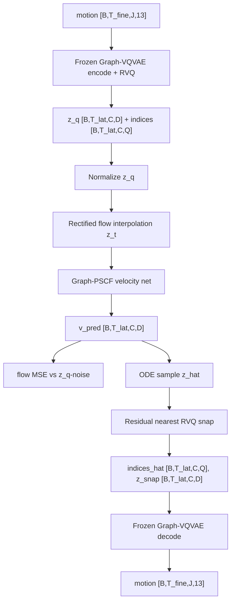

# Graph-CodeFlow PSCF Double/Single Implementation Plan

Date: 2026-06-09
Status: implementation handoff, no code changed by this document
Dataset target: `data/animo4d_anytop_clean_L5`
Tokenizer target: frozen Graph-VQVAE / RVQ tokenizer

## 0. Verdict

We should replace the current Level-A Graph-CodeFlow backbone as the formal
training path with a graph-aware PSCF / FLUX-style double-stream + single-stream
DiT backbone.

This is not an ablation plan. The intended implementation path is one main model:

```text
model_variant = graph_pscf
hidden_size = 512
code_dim = 512
n_heads = 8
d_ff = 2048
depth_double = 6
depth_single = 12
dropout = 0.05
```

Keep the existing Level-A implementation only for compatibility and smoke/debug.
Do not run a large sweep over shallow variants. If the main model is too slow or
OOMs, reduce by engineering fallback only, not as a scientific ablation.

## 1. Why We Need This Change

The current `GraphStructuredCodeFlow` is graph-aware, but it is still a shallow
Level-A probe. Each layer is:

```text
graph-spatial over C
-> temporal over T
-> token text cross-attn
-> global text add
-> FiLM
```

Current code evidence:

- [graph_codeflow.py](../src/models/CodeFlow_Model/graph_codeflow.py#L67): `GraphCodeFlowLayer` owns graph, temporal, and text blocks.
- [graph_codeflow.py](../src/models/CodeFlow_Model/graph_codeflow.py#L94): graph-spatial attention over coarse slots.
- [graph_codeflow.py](../src/models/CodeFlow_Model/graph_codeflow.py#L104): temporal attention over latent frames.
- [graph_codeflow.py](../src/models/CodeFlow_Model/graph_codeflow.py#L111): token cross-attn and global text add.
- [graph_codeflow.py](../src/models/CodeFlow_Model/graph_codeflow.py#L125): Level-A skip-transformer wrapper.
- [train_graph_codeflow.py](../scripts/train_graph_codeflow.py#L198): current training args expose `n_layers=5`.

This is good enough to prove the RVQ flow path is wired correctly:

```text
z_q -> flow -> residual nearest snap -> frozen decode
```

It is not a full CodeFlow-style condition-fusion backbone. The original CodeFlow
strength comes from a FLUX/DiT pattern:

```text
6 x double-stream blocks
12 x single-stream blocks
```

Original CodeFlow evidence:

- [dit_blocks.py](../outside_docs/CodeFlow/models/codeflow/dit_blocks.py#L214): `DoubleStreamBlock`, where motion and text are separate streams but jointly attend.
- [dit_blocks.py](../outside_docs/CodeFlow/models/codeflow/dit_blocks.py#L279): `SingleStreamBlock`, where concatenated motion/text tokens self-attend together.
- [dit_blocks.py](../outside_docs/CodeFlow/models/codeflow/dit_blocks.py#L540): `FrameMotionTextDiT`, the frame-level double/single stack.
- [part_structured_motion_code_flow.py](../outside_docs/CodeFlow/models/codeflow/part_structured_motion_code_flow.py#L74): original PSCF packs fixed body parts into one frame-level motion token before the DiT.

The original standard HumanML3D configuration has:

```text
hidden_size = 768
num_heads = 12
depth_double = 6
depth_single = 12
```

Parameter count checked locally:

```text
Original CodeFlow FrameMotionTextDiT, H=768: ~297.61M
Same frame DiT shape, H=512:                 ~132.34M
Current Level-A Graph-CodeFlow:              ~38.63M
```

The current 38M model is too small for the formal L5 backbone, especially because
L5 is larger and more topologically diverse than HumanML3D.

## 2. Design Principle

Do not directly flatten `[T*C]` and concatenate text for one giant full attention.

Bad shortcut:

```text
motion = reshape([B,T,C,D]) -> [B,T*C,D]
joint = concat(motion, text)
full self-attn over [T*C + L]
```

Why this is wrong:

- It discards the clean separation between graph slot structure and frame-level
  text fusion.
- `T*C` can be around `16*50=800` tokens before text, so full attention is
  expensive.
- Graph bias over pooled topology is awkward to preserve once everything is just
  a flat token sequence.
- Original PSCF does not do that either. It first groups fixed parts into a
  frame-level token, then applies the double/single DiT.

Correct adaptation:

```text
Original CodeFlow:
  6 fixed body parts -> one frame motion token -> double/single text-motion DiT

Our Graph-CodeFlow:
  C variable graph coarse slots -> graph-aware frame token -> double/single text-motion DiT
  while retaining a slot stream for graph-temporal slot updates and final output
```

## 3. Target Information Flow

Training target remains the frozen post-RVQ latent `z_q`, not pre-RVQ encoder
features and not indices.



Internal backbone streams:

```text
slot stream:  h_slot  [B, T_lat, C, D]   # graph-pooled RVQ latent grid
frame stream: h_frame [B, T_lat, H]      # graph-aware frame holder tokens
text stream:  h_text  [B, L, H]          # T5 token stream
```

For v1 formal model, set `H = D = 512`. Supporting `H != D` is fine, but not
necessary for the first implementation.

## 4. Architecture

### 4.1 Input And Conditioning

Inputs already available from token export:

```text
z_q / z_t                     [B,T_lat,C,D]
token_mask                    [B,T_lat,C]
coarse_mask                   [B,C]
frame_mask_lat                [B,T_lat]
pooled_adjacency              [B,C,C]
pooled_geodesic               [B,C,C]
pooled_skeleton_embeddings    [B,C,D]
caption_emb                   [B,768]
caption_token_emb             [B,L,768]
caption_token_mask            [B,L]
has_text                      [B]
```

The flow math in [flow.py](../src/models/CodeFlow_Model/flow.py#L136) should stay
the same:

```text
x = normalize(z_q)
z_t = t*x + (1-t)*noise
v_target = x - noise
loss = masked MSE(v_pred, v_target)
```

The new model only replaces the velocity network.

### 4.2 Required Modules

Add new files under `src/models/CodeFlow_Model/`. Do not modify Gaussian VAE,
latent diffusion, Graph-VQVAE training, or `graph_salad` behavior.

Recommended new files:

```text
src/models/CodeFlow_Model/dit_blocks.py
src/models/CodeFlow_Model/graph_pscf.py
```

`dit_blocks.py` should locally adapt the CodeFlow/FLUX blocks:

- `RMSNorm`
- `SwiGLU`
- `MultiHeadAttention`
- `AdaLNModulation`
- `DoubleStreamBlock`
- `SingleStreamBlock`

Use our local T5 embeddings, not CLIP. Do not import runtime code from
`outside_docs/CodeFlow`; copy/adapt the relevant blocks into our branch so the
project is self-contained and auditable.

`graph_pscf.py` should define:

```text
GraphSlotTemporalBlock
GraphFrameSlotCoupling
GraphPSCFFlowNet
```

### 4.3 GraphSlotTemporalBlock

Purpose: keep the slot stream graph-aware and temporal-aware.

Input:

```text
h_slot [B,T,C,D]
pooled_adjacency [B,C,C]
pooled_geodesic [B,C,C]
coarse_mask [B,C]
frame_mask_lat [B,T]
t_emb [B,D]
```

Operation:

```text
1. graph-spatial over C, per latent frame
   reshape [B*T,C,D]
   use GraphAttentionBlock with pooled_adjacency / pooled_geodesic

2. temporal attention over T, per coarse slot
   reshape [B*C,T,D]
   use TemporalSelfAttention

3. AdaLN/FiLM with timestep embedding

4. strict re-mask
```

This can reuse the logic from the current Level-A block, especially
[graph_codeflow.py](../src/models/CodeFlow_Model/graph_codeflow.py#L94) and
[graph_codeflow.py](../src/models/CodeFlow_Model/graph_codeflow.py#L104).

### 4.4 GraphFrameSlotCoupling

Purpose: graph-aware replacement for CodeFlow's fixed-part frame holder coupling.

Original CodeFlow has fixed `num_parts=6`, and its holder coupling assumes a
regular part grid. We need the same idea, but for variable `C` graph slots.

For each latent frame:

```text
frame token: h_frame[:,t]       [B,1,D]
slot tokens: h_slot[:,t]        [B,C,D]
seq = concat(frame_holder, slots) -> [B,1+C,D]
```

Extend graph metadata:

```text
extended adjacency [B,1+C,1+C]
  holder <-> every valid slot: 1
  slot <-> slot: pooled_adjacency
  diagonal: 0

extended geodesic [B,1+C,1+C]
  holder to valid slot: 1
  slot to slot: pooled_geodesic
  holder diagonal: 0
  invalid/padded entries masked out by node_mask
```

Run one or more `GraphAttentionBlock`s on this extended graph, then split:

```text
new frame token = seq[:,0]       [B,D]
new slot tokens = seq[:,1:]      [B,C,D]
```

This is the key graph-aware bridge between slot-level topology and frame-level
CodeFlow fusion.

Do not replace this with a plain masked mean unless the graph version fails
basic smoke. A plain mean would be an implementation shortcut and would weaken
the design.

### 4.5 Double Stream Stage

Depth: `depth_double = 6`.

Each double block should do:

```text
1. h_slot = GraphSlotTemporalBlock(h_slot)
2. h_frame, h_slot = GraphFrameSlotCoupling(h_frame, h_slot)
3. h_frame, h_text = DoubleStreamBlock(h_frame, h_text, cond)
4. h_frame, h_slot = GraphFrameSlotCoupling(h_frame, h_slot)
5. strict mask h_slot / h_frame / h_text
```

Why two couplings:

- before double block: summarize current graph slots into frame stream
- after double block: inject text-updated frame state back into graph slots

This is the important part. The frame/text DiT must not be detached from the slot
stream.

### 4.6 Single Stream Stage

Depth: `depth_single = 12`.

Each single block should do:

```text
1. joint = concat(h_frame, h_text)        # [B,T_lat+L,D]
2. joint = SingleStreamBlock(joint, cond)
3. split joint -> h_frame, h_text
4. h_slot = GraphSlotTemporalBlock(h_slot)
5. h_frame, h_slot = GraphFrameSlotCoupling(h_frame, h_slot)
6. strict mask
```

This preserves the CodeFlow idea:

```text
double stream: separate motion/text streams with joint attention
single stream: one unified motion+text stream
```

while keeping final output tied to graph slots.

### 4.7 Output

The output target is still slot velocity:

```text
v_pred [B,T_lat,C,D]
```

Use:

```text
LayerNorm(D)
zero-init Linear(D,D)
strict mask
```

Zero-init output is important for stable flow startup, matching the current
Level-A behavior in [graph_codeflow.py](../src/models/CodeFlow_Model/graph_codeflow.py#L188).

## 5. File-By-File Implementation Checklist

### 5.1 `src/models/CodeFlow_Model/dit_blocks.py`

Implement local CodeFlow/FLUX-style blocks.

Must include:

- RoPE-compatible multi-head attention
- AdaLN-zero modulation with shift / scale / gate
- double-stream motion/text block
- single-stream joint block
- all-masked text rows safe under CFG

Port/adapt from:

- [dit_blocks.py](../outside_docs/CodeFlow/models/codeflow/dit_blocks.py#L214)
- [dit_blocks.py](../outside_docs/CodeFlow/models/codeflow/dit_blocks.py#L279)

Do not import from `outside_docs` at runtime.

### 5.2 `src/models/CodeFlow_Model/graph_pscf.py`

Implement:

```python
class GraphSlotTemporalBlock(nn.Module): ...
class GraphFrameSlotCoupling(nn.Module): ...
class GraphPSCFFlowNet(nn.Module): ...
```

`GraphPSCFFlowNet.forward(...)` should take the same conditioning contract as
the current `GraphStructuredCodeFlow.forward(...)`:

```text
z_t, timesteps,
text_global, text_tokens, text_token_mask, has_text,
pooled_adjacency, pooled_geodesic, pooled_skeleton_embeddings,
coarse_mask, frame_mask_lat
```

and return:

```text
v_pred [B,T_lat,C,D]
```

The API should be drop-in compatible with `GraphCodeFlow.predict_velocity`.

### 5.3 `src/models/CodeFlow_Model/flow.py`

Add a model selector:

```text
model_variant in {"level_a", "graph_pscf"}
```

Behavior:

- `level_a` builds the existing `GraphStructuredCodeFlow`.
- `graph_pscf` builds the new `GraphPSCFFlowNet`.
- `flow_loss`, `predict_clean_from_velocity`, `sample`, normalization, CFG, and
  masked MSE should remain shared.

Old checkpoints should still load. Use checkpoint args:

```python
model_variant = args.get("model_variant", "level_a")
```

when reconstructing old runs.

### 5.4 `scripts/train_graph_codeflow.py`

Add args:

```text
--model_variant {level_a,graph_pscf}   default graph_pscf for formal training
--hidden_size 512
--depth_double 6
--depth_single 12
--mlp_ratio 4.0
```

Keep these existing defaults:

```text
--code_dim 512
--n_heads 8
--d_ff 2048
--epochs 600
--lr_scheduler half_cosine
--warmup_steps 2000
--cond_drop_prob 0.1
--terminal_loss_weight 0.0
--clean_loss_weight 0.0
```

Set formal `graph_pscf` dropout to `0.05`, matching CodeFlow standard. If keeping
script default `0.1` for Level-A compatibility, make the launcher pass
`--dropout 0.05` explicitly for `graph_pscf`.

### 5.5 `scripts/animate_graph_codeflow.py`

Reconstruct the flow model from checkpoint args:

```text
model_variant
hidden_size
depth_double
depth_single
mlp_ratio
```

Sampling path should stay the same:

```text
ODE -> z_hat -> nearest_residual_ids -> z_snap -> decode_from_indices
```

### 5.6 `scripts/_smoke_graph_codeflow.py`

Add smoke coverage for both:

```text
--model_variant level_a
--model_variant graph_pscf
```

But formal acceptance is for `graph_pscf`. Level-A is compatibility only.

## 6. Training Configuration

Main run:

```text
dataset:      data/animo4d_anytop_clean_L5
token cache:  export from final frozen Graph-VQVAE L5 checkpoint
caption:      cleanL5 T5 multi cache, 100% text coverage required
model:        graph_pscf
code_dim:     512
hidden_size:  512
n_heads:      8
d_ff:         2048
depth_double: 6
depth_single: 12
dropout:      0.05
loss:         flow only
terminal CE:  off
clean loss:   off
norm:         empirical z_q train-set norm
CFG drop:     0.1
epochs:       600
scheduler:    half_cosine
warmup:       2000 steps minimum
```

Batch/lr rule:

- Start from CodeFlow standard global batch 64 / lr 1e-4.
- If actual global batch is larger, scale LR linearly unless smoke shows
  instability.
- Example: global batch 128 -> lr 2e-4.

This is not a broad sweep. Pick the largest stable batch that has good throughput,
then run the main model.

## 7. Required Smoke And Audit Gates

### Gate 1: Shape And Mask

For a real L5 token batch:

```text
input z_t: [B,T,C,512]
output v_pred: [B,T,C,512]
padded tokens output exactly 0
no NaN/Inf
```

### Gate 2: Graph Condition Is Used

Run the same batch twice:

```text
normal pooled_adjacency / pooled_geodesic
shuffled or zeroed pooled_geodesic
```

The output should change on valid tokens. If it does not, the graph stream is not
actually wired.

### Gate 3: Text Condition Is Used

Run:

```text
cond has_text=True
uncond has_text=False
```

Both global and token text paths should independently change the output. This
follows the existing text-positive smoke requirement from cleanL5.

### Gate 4: Parameter Count

Expected scale:

```text
Frame double/single H=512 alone: ~132M
Full graph_pscf with slot stream: expected roughly 220M-300M
```

If the final model is still only tens of millions of parameters, assume the
double/single backbone or slot-frame coupling was not implemented correctly.

### Gate 5: RVQ Projection And Decode

For model output:

```text
z_hat -> nearest_residual_ids -> z_snap -> decode
```

must be finite. Log:

```text
projection_error
code_usage_per_q
continuous-vs-snapped decode gap
```

### Gate 6: Visual QA

Before long training:

- render a tiny overfit or early checkpoint with GT-vs-pred GIFs
- include slow, fast, long-chain, and high-branch species
- do not accept metric-only progress

After launch:

- render early QA after the first meaningful checkpoint
- inspect continuous decode and snapped decode separately

## 8. What Not To Do

Do not:

- turn this into a `5/13/21/31/41 layers` sweep
- train Level-A as a competitor unless debugging a hard failure
- flatten `[T*C]` into a plain full-attention sequence and call it CodeFlow
- remove pooled graph conditioning
- feed species/object IDs as shortcuts
- change Graph-VQVAE, Gaussian VAE, or latent diffusion behavior
- add terminal CE in v1 unless flow-only snapped decoding fails specifically due
  to code projection, and only after reporting the failure

## 9. Suggested Execution Order

```text
M0. Port/adapt DiT blocks locally
M1. Implement GraphSlotTemporalBlock + GraphFrameSlotCoupling
M2. Implement GraphPSCFFlowNet
M3. Add model_variant selector in flow.py
M4. Add train/animate/smoke args
M5. Run py_compile + unit shape tests
M6. Run graph/text positive smoke
M7. Run mem_profile for graph_pscf
M8. Run short train smoke
M9. Launch formal graph_pscf training
M10. Render continuous-vs-snapped visual QA
```

Every code change should go through Codex review with `gpt-5.5` and xhigh
reasoning. Do not launch the formal 600-epoch run until the graph/text smoke and
RVQ decode smoke pass.

## 10. Implementation Prompt For Executor

Please implement the graph-aware PSCF / FLUX-style double-stream + single-stream
Graph-CodeFlow backbone described in:

```text
handoff/20260609_graph_codeflow_pscf_double_single_impl_plan.md
```

Hard requirements:

1. Keep this branch separate from Gaussian VAE / latent diffusion / Graph-VQVAE
   training. Do not change their behavior.
2. Add a new `graph_pscf` model variant under `src/models/CodeFlow_Model/`.
3. Preserve the existing Level-A model for backward compatibility and smoke only.
4. Use CodeFlow-style `DoubleStreamBlock` and `SingleStreamBlock` logic, adapted
   locally from `outside_docs/CodeFlow/models/codeflow/dit_blocks.py`.
5. Keep the slot stream graph-aware using `GraphAttentionBlock` with
   `pooled_adjacency` and `pooled_geodesic`.
6. Do not flatten `[T*C]` into plain full attention as the main solution.
7. Train target remains frozen post-RVQ `z_q [B,T,C,D]`; flow predicts velocity
   in normalized `z_q` space.
8. Main config is `hidden_size=512`, `code_dim=512`, `heads=8`,
   `depth_double=6`, `depth_single=12`, `d_ff=2048`, `dropout=0.05`.
9. Add smoke tests for shape/mask, graph conditioning, text conditioning,
   parameter count, RVQ snap/decode, and continuous-vs-snapped QA.
10. After implementation, run py_compile, smoke, and Codex review before any
    formal training launch.

Acceptance:

- `graph_pscf` forward returns `[B,T,C,512]` with padded tokens exactly zero.
- Parameter count is in the expected formal-backbone range, not ~38M.
- Shuffling graph metadata changes output.
- Dropping text changes output.
- ODE sample -> residual nearest snap -> frozen decode is finite.
- Visual QA GIFs are rendered before treating training as healthy.

